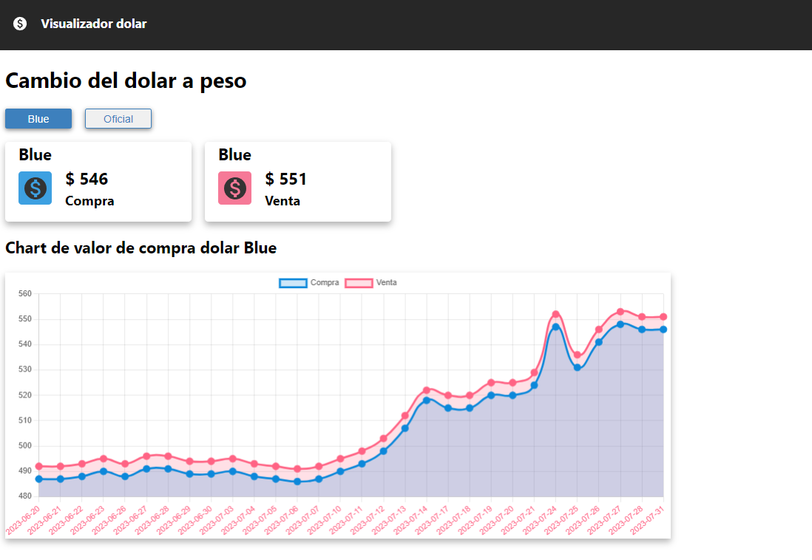

# Dolar App

Aplicación de visualizacion valor del dolar blue y oficiol con React Vite utilizando la API: **https://bluelytics.com.ar/#!/api**.

Se utilizó la biblioteca de **chart.js** para el chart en la aplicación.

## Tecnologías utilizadas

- React
- Vite
- Chart.js

## Link

https://dolar-app-one.vercel.app/
